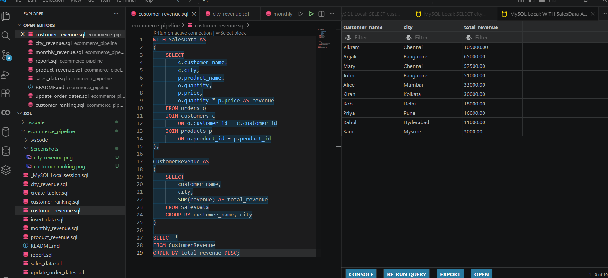
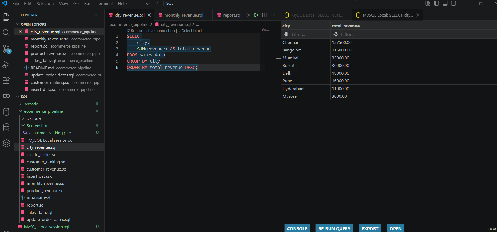
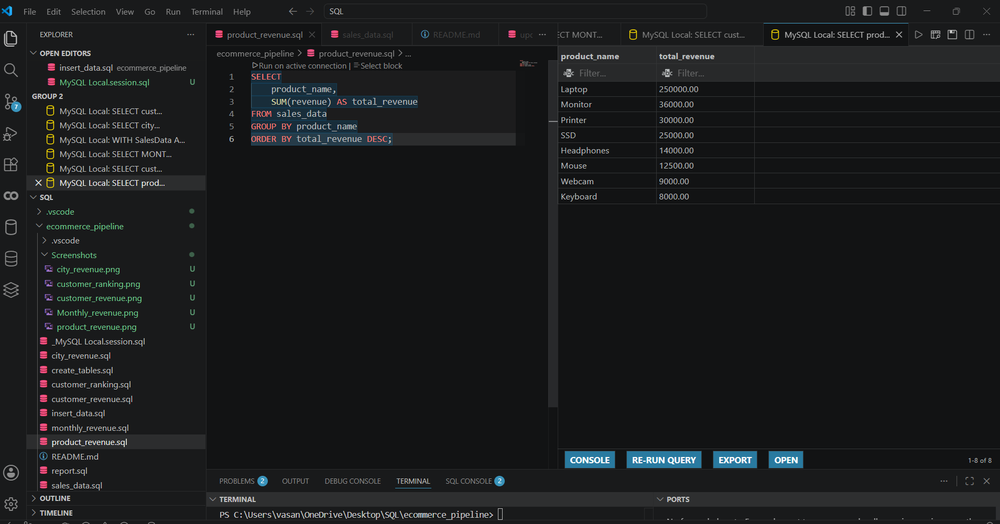
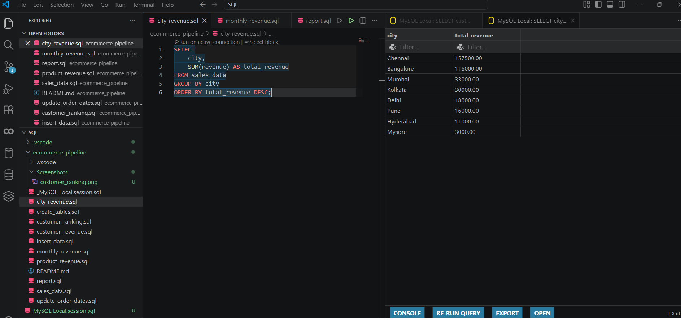
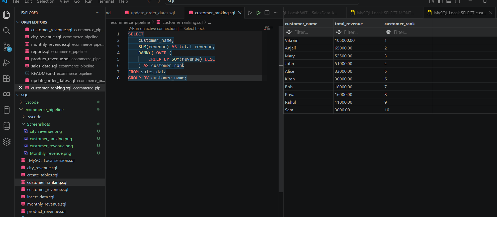

# E-Commerce Revenue Analysis Pipeline

## Project Overview

This project demonstrates an end-to-end SQL pipeline for analyzing e-commerce sales data using MySQL.

The pipeline combines customer, product, and order data to generate business reports that help stakeholders understand revenue performance.

## Business Questions

1. Which city generates the highest revenue?
2. Which products generate the highest revenue?
3. Who are the top customers?
4. How does revenue change month by month?

## Database Schema

Tables used:

* customers
* products
* orders

## Pipeline Flow

customers

    ↓

orders

    ↓

products

    ↓

sales_data View

    ↓

Business Reports

## Reports Generated

### Customer Revenue

Calculates total revenue generated by each customer.

### City Revenue

Calculates total revenue generated by each city.

### Product Revenue

Calculates total revenue generated by each product.

### Customer Ranking

Ranks customers based on revenue using SQL window functions.

### Monthly Revenue

Tracks revenue trends across different months.

## SQL Concepts Used

* Joins
* Views
* Aggregations
* GROUP BY
* ORDER BY
* Window Functions
* RANK()
* Date Functions

## Technologies Used

* MySQL
* SQL
* Git
* GitHub
* VS Code

## Project Structure

create_tables.sql

insert_data.sql

update_order_dates.sql

sales_data.sql

customer_revenue.sql

city_revenue.sql

product_revenue.sql

customer_ranking.sql

monthly_revenue.sql

report.sql

README.md

## Key Insights

* Chennai generated the highest revenue.
* Laptop was the highest revenue generating product.
* Vikram was the top customer.
* Revenue increased significantly during May and June.

## Sample Outputs

### Customer Revenue

### City Revenue

### Product Revenue

### Customer Ranking

### Monthly Revenue

## Author

Vasanthkumar H S
Aspiring Data Analyst | SQL | Python | Power BI
